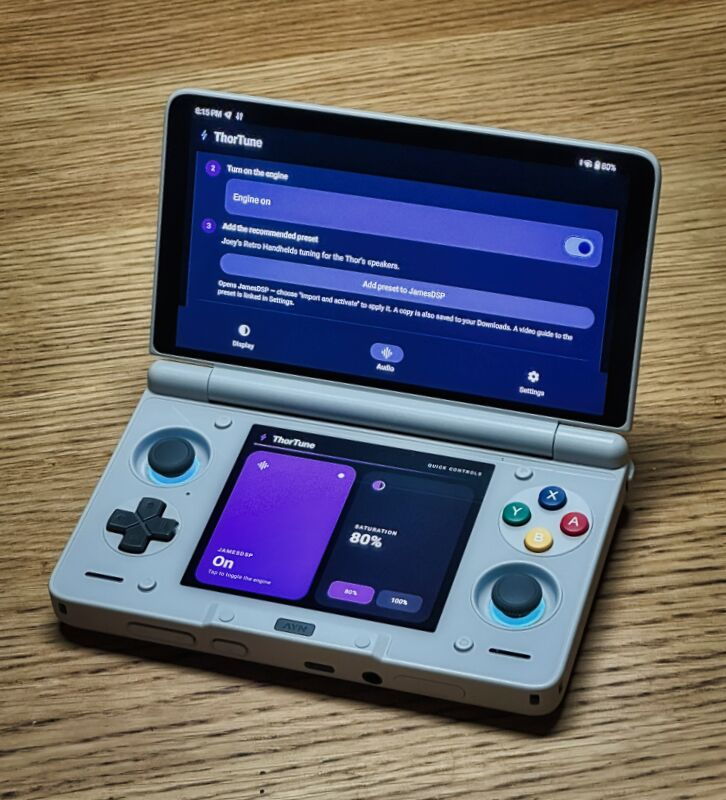
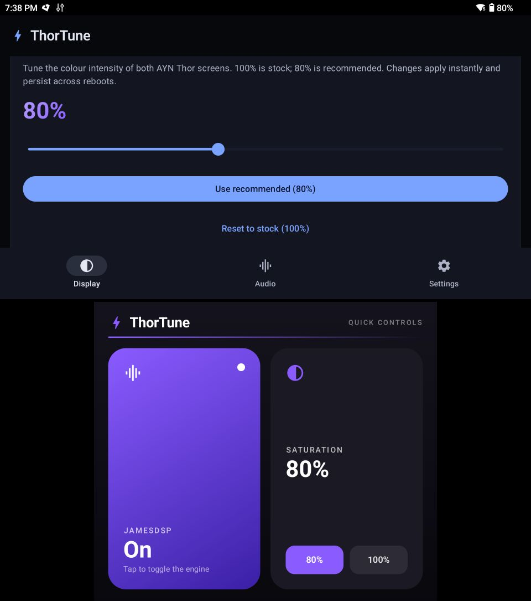

# ⚡ ThorTune

**Better sound and better-looking screens for your AYN Thor. One clean app, no rooting required.**

ThorTune gives your Thor two upgrades that normally take fiddly manual setup:

- 🎨 **Richer screen colours** - dial in the colour intensity of both screens with a single
  slider. The stock screens are too saturated; a touch less saturation looks more natural.
- 🔊 **Bigger, clearer audio** - a system-wide equaliser and audio engine (JamesDSP) that
  makes the Thor's speakers sound dramatically better, with a ready-made preset tuned for the
  device.

Both screens get a control panel: the main app on the top screen, and a live quick-controls
panel on the lower screen so you can tweak things without leaving your game.

  
  &nbsp;
  

## Getting started

1. **Download and install ThorTune** from the [releases page](https://github.com/androosio/thortune/releases), then open it. Allow the notification permission when asked.
2. **Set the screen colour** - go to the **Display** tab and drag the slider. **100% is stock**;
   **80% is recommended**. Changes apply instantly and stick after a reboot.
3. **Set up the audio** - go to the **Audio** tab and follow the on-screen steps:
   - Install **JamesDSP Manager** (the audio engine ThorTune drives) - tap the button and run
     through the standard installer.
   - **Turn on the engine** with the switch.
   - **Add the recommended preset** - tap the button, then choose **Import and activate** in
     JamesDSP. This loads Joey's Retro Handhelds tuning made for the Thor's speakers. (A copy is
     also saved to your Downloads.)
4. **Lower-screen panel** - the quick-controls panel on the bottom screen lets you toggle the
   audio engine and switch saturation presets on the fly. You can turn it off in **Settings**.

That's it. Your settings survive reboots, so this is a set-it-and-forget-it install.

## Credits

ThorTune builds on the work of others - it bundles Tim Schneeberger's JamesDSP Manager fork and
combines the JamesDSP setup from [o2ptweaks.app](https://github.com/FeralAI/o2ptweaks.app)
(based on [jdsp4rp5.app](https://github.com/kokoko3k/jdsp4rp5.app) by kokoko3k) with a saturation
control derived from [OdinTools](https://github.com/langerhans/OdinTools). The recommended audio
preset is based on [Joey's Retro Handhelds amazing video](https://www.youtube.com/watch?v=kk5Q4DtMrME).

## For developers

Curious how it works, or want to build it yourself? See **[docs/TECHNICAL.md](docs/TECHNICAL.md)**.

## License

GNU General Public License v2.0 - see [LICENSE](LICENSE). Inherited from the upstream projects
above.
</content>
